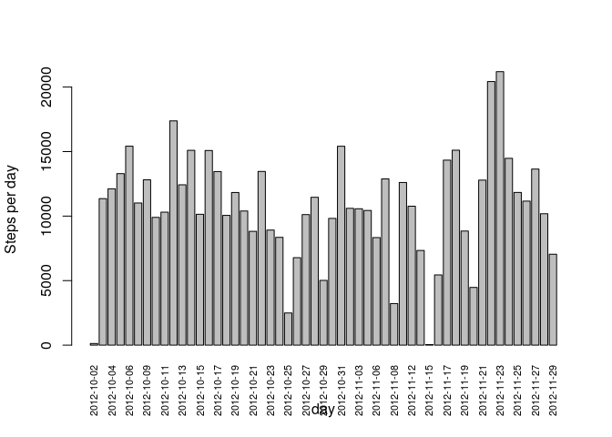
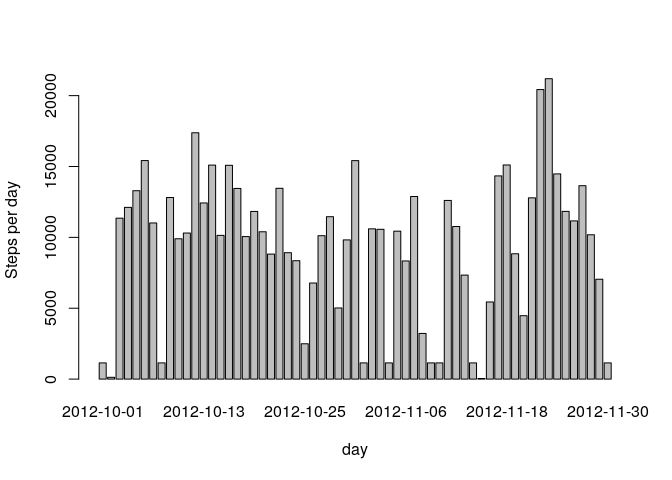
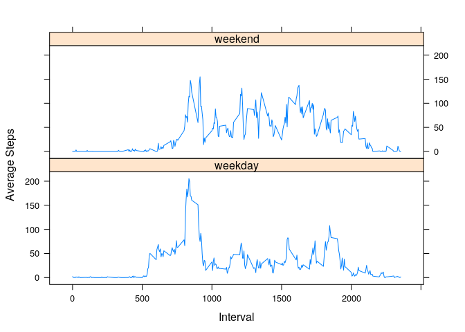

This is a document created for the first Peer Review assignment of the Course 5,
reproducible research. This assignment consists of a statistical analysis of the
Dataset that contains the number of step calculated for an interval of 5 minutes
for one volunteer.

Before starting to work with data, set the correct working directory:

```r
setwd("./")
```
## Loading and preprocessing data:
The code above generated a the table containing the data we will be using in the
next exercises. *Is the answer for the first item on the assignment.*

```r
library(zip); library(readr); library(dplyr); library(lattice)
download.file("https://d396qusza40orc.cloudfront.net/repdata%2Fdata%2Factivity.zip",
              destfile = "Dataset_course5.zip", method = "curl")
data <- read_csv("Dataset_course5.zip") #With the usage of readr package
data_clean <- data[complete.cases(data),]
```

## What is mean total number of steps taken per day?

The code bellow aggregate all the steps taken by the date and generates the barplot
of this sum. *The plot above is the answer for the second item on the assignment.*

```r
step_day <- aggregate(data_clean$steps, by = list(Date = data_clean$date), FUN = sum)
barplot(step_day$x, names.arg = step_day$Date, ylab = "Steps per day", xlab = "day", cex.names=0.68, las=3)
```

<!-- -->

## What is the average daily activity pattern?
**The median and mean of steps taken each day**

Since we already have a table containing the sum of steps each day, this calculation is pretty simple.

```r
median_day <- median(step_day$x); mean_day <- mean(step_day$x)
```

The mean of steps is 10766 and the median is 10765. Numbers very close.*This is the answer for the third item of the assignment.*

**Time series of the average of steps taken each day**

Similarly with what we done for the total of steps, we can calculate the average 
of steps taken each day with the 'aggregate' function. Then, we can remove the
'NA' values and create the plot.

```r
average_day <- aggregate(data_clean$steps, by = list(Date = data_clean$date), FUN = mean)
plot(average_day, type = "l", ylab = "Average Steps")
```

<!-- -->

*The plot produced above is the answer for item 4.*

**Which 5-minute interval contain, on average, maximum steps.**

This is a little tricky! We can do this by aggregating based on the intervall, instead of the
data. Then, we apply the max function: 

```r
average_interval <- aggregate(data_clean$steps, by = list(Interval = data_clean$interval), FUN = mean)
max_int <- average_interval$Interval[average_interval$x == max(average_interval$x)]
```
The interval with the maximum average number of steps is 835. 
*This is the answer of the item 5*.

## Imputing missing values


Inputting the missing data is a challenge because we need to decide what to do with them. In
all the above analysis, we simply excluded them using the complete cases. This is a valid option,
but it creates gaps within the data that can be harmful. Here, I will assign to each
value the median of the interval:

```r
median_interval <- aggregate(data_clean$steps, by = list(interval = data_clean$interval), FUN = median)
#Coying the data to a new table
data_NA <- data 
#Merge and change the 'NA' in steps by the median:
data_NA <- merge(data_NA, median_interval, by = "interval")
data_NA <- mutate(data_NA, steps = ifelse(is.na(steps), x, steps))
```
This creates a dataframe 'data_NA' that in place of 'NA' values within steps, have the median of the
steps by that interval. *This is the answer for item 6.*

**Histogram of total number of steps after missing values are inputed.**

```r
step_NA <- aggregate(data_NA$steps, by = list(Date = data_NA$date), FUN = sum)
barplot(step_NA$x, names.arg = step_NA$Date, ylab = "Steps per day", xlab = "day")
```

<!-- -->

*The graph above is the answer for item 7.*

## Are there differences in activity patterns between weekdays and weekends?
**Panel plot comparing the average number of steps taken per 5-minute interval across weekdays and weekends**
For this, we will need to create a new column indicating which if the day is a weekday or part of the weekend. 

```r
##First, remove the unecessary columns:
data_NA$x <- NULL

#Creating a new column with the weekdays:
#I am using a version of R in brazilian portuguese. That is why I use 'sabado' for Saturday
#and 'domingo' for Sunday.
data_NA <- mutate(data_NA, week = ifelse(weekdays(data_NA$date) == "sábado" | weekdays(data_NA$date) == "domingo", "weekend", "weekday"))

#Grouping the data based on interval and weekday
average_week <- data_NA %>% group_by(interval, week) %>% summarise(avg = mean(steps))
#> `summarise()` regrouping output by 'interval' (override with `.groups` argument)
xyplot(avg ~ interval | week, data = average_week, layout = c(1, 2), ylab = "Average Steps", xlab = "Interval", type = "l")
```

<!-- -->

This generates a panel plot comparing the average steps in each 5 minute interval. *This is the answer to item 8.*

*Since all the code is present within this documents, the item 9 is also answered.*
